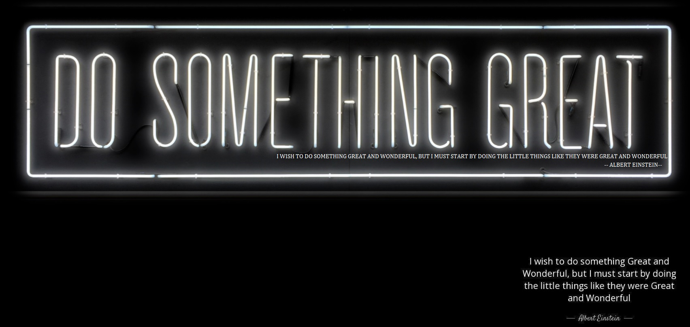

<!-- <h2 align='center'>Michael Gates @ michaelpgates</h2>

<b>Cybersecurity & Programming Student</b>
 -->

<h2></h2>

 

<h2>Hey! 👋,My name is Michael Gates</h2>

💻 I'm Currently workng on
----------------------------
- <i>Student:</i> Flatiron Cybersecurity Analyst Bootcamp. 
- <i>Student:</i> Western Governors University - B.S. Network Operations and Security

<h2>👀 Stats</h2>

  
  

  <b><em>GitHub Stats:</em></b>  
       
  <b><em>Programming activity (Last 7 days):</em></b>  
    
  

<h2> About me⚡:</h2>

I am an enthusiastic, hardworking individual looking to break into the cybersecurity field. I have been a lifelong computer enthusiast having worked on a range of computers from the commodore 64 to custom built gaming PCs. As a USAF veteran, I have 6 years of military experience as an aircraft mechanic and I am currently an associate at an Amazon sortation center. At this point in my life I am beyond focused and disciplined. I am actively and relentlessly improving my skills and exposure in the cybersecurity and programming field with the desire to make a meaningful impact.
 

<h2>🤝 Connect:</h2>

